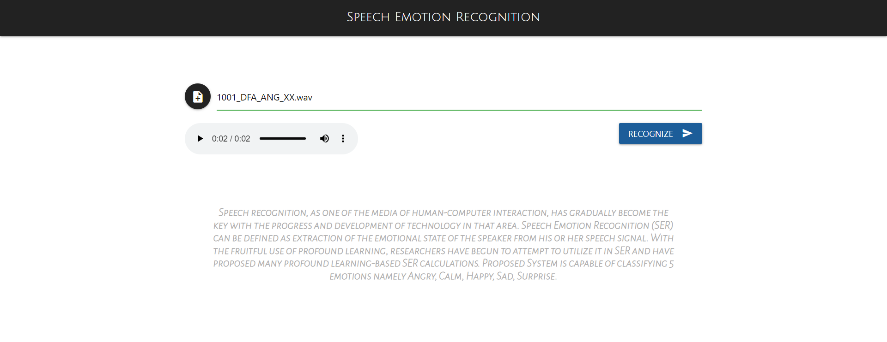

<!-- PROJECT LOGO -->
<br />
<div align="center">
  <a href="https://github.com/Bishal-Nakoda/SER">
    
  </a>

  <h3 align="center">Speech Emotion Recognition</h3>

  <p align="center">
    An interactive interface for machine learning model!
    <br />
    <a href="https://github.com/Bishal-Nakoda/SER"><strong>Explore the code »</strong></a>
    <br />
    <br />
  </p>
</div>

<!-- ABOUT THE PROJECT -->
## About The Project


Emotions plays a vital role in a human’s life as it is a medium of expression of one’s perspective to others. With the Help of Speech Emotion Recognition (SER), we can recognize the emotions a person is experiencing just from his/her speech. Essentially, Speech Emotion Recognition (SER) can help us further develop man-machine interface.

Here's how:
* A feature selection technique is assessed to obtain good features from the set of features extracted
* The expected output is the type of emotion which will be derived from the raw speech signal given as input by the user
* A spectrogram(a visual way of representing the signal strength) is also provided along with the output 

<p align="right">(<a href="#top">back to top</a>)</p>

### Built With

This section lists major frameworks/libraries used to bootstrap this application. 

* [Python](https://www.python.org/)
* [Numpy](https://numpy.org/)
* [Keras](https://keras.io/)
* [Tensorflow](https://www.tensorflow.org/)
* [Matplotlib](https://matplotlib.org/)
* [Librosa](https://librosa.org/doc/latest/index.html)
* [Flask](https://flask.palletsprojects.com/en/2.0.x/)
* [Materializecss](https://materializecss.com/)


<p align="right">(<a href="#top">back to top</a>)</p>

<!-- GETTING STARTED -->
## Getting Started

To get a local copy up and running follow these simple example steps.

### Prerequisites

How to get things you need to use the software and how to install them.
* PowerShell
  ```sh
  pip install -r requirements.txt
  ```

### Installation


Below is a step by step instruction for setting up the application. *Tip: Use virtualenv which allows you to manage separate package installations for different projects.*

1. Open Shell/CommadPrompt
1. Clone the repo
   ```sh
   git clone https://github.com/Bishal-Nakoda/SER.git
   ```
3. Install required packages
   ```sh
   pip install -r requirements.txt
   ```
4. Simply run application
   ```sh
   python app.py
   ```
   Debugger will be activated on LocalHost

<p align="right">(<a href="#top">back to top</a>)</p>

<!-- CONTACT -->
## Developers

Bishal Nakoda - [GitHub](https://github.com/Bishal-Nakoda)

Rutuparna Kudtarkar - [GitHub](https://github.com/rutuparna07)

Keyur Mod - [GitHub](https://github.com/BearOnBeets)

<p align="right">(<a href="#top">back to top</a>)</p>

<!-- LICENSE -->
## License

Distributed under the MIT License.
<p align="right">(<a href="#top">back to top</a>)</p>
